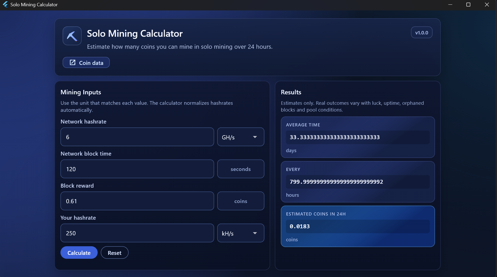

# ⛏️ GuiCalc: Solo Mining Calculator

**GuiCalc** is a modern, high-precision desktop tool designed for cryptocurrency miners to estimate their performance in **Solo Mining**.

## 🚀 Key Features

- **Maximum Precision**: Uses high-precision calculations (`decimal` and `rational` libraries) to avoid rounding errors on hashrates and block rewards.
- **Smart Unit Management**: Easily switch between units (H/s, kH/s, MH/s, GH/s, TH/s, PH/s, EH/s, ZH/s). The application automatically normalizes values for you.
- **Real-Time Estimates**:
    - Average time to find a block (in days).
    - Discovery frequency (in hours).
    - Estimated earnings over 24 hours.
- **Premium Interface**: Sleek, responsive Dark Mode design optimized for desktop usage.

## 💻 Available Platforms

The application is provided as native executables for:
- **Windows** (`.exe`): Optimized for Windows 10 and 11.
- **Linux** (`x64`): Compatible with most modern Linux distributions (Ubuntu, Debian, etc.).

## 📖 How to Use

1. **Network Hashrate**: Enter the current network hashrate of the coin you are mining.
2. **Network Block Time**: Specify the average block generation time on that network (in seconds).
3. **Block Reward**: Enter the current reward for a mined block.
4. **Your Hashrate**: Enter your own machine's computing power.
5. Click **Calculate** to get your instant estimates.

---

> [!IMPORTANT]
> **Note on results**: Provided values are statistical estimates based on probability. Actual results depend on luck, your machine's uptime, and network conditions at the time of mining.
